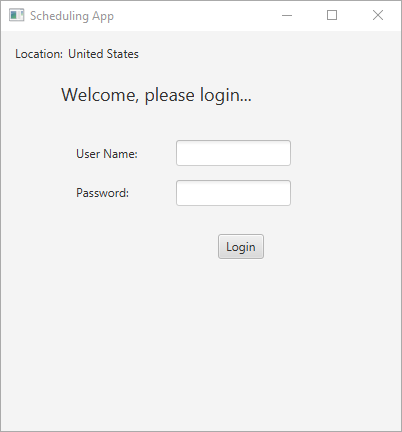
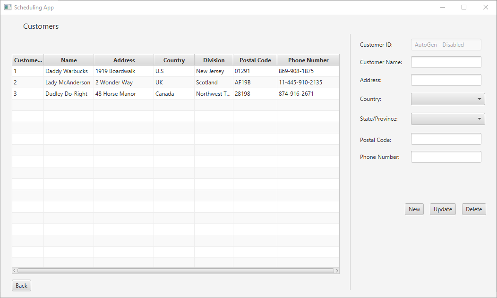
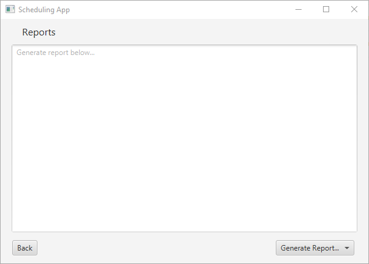

<div id="top"></div>
<!--
*** Thanks for checking out the Best-README-Template. If you have a suggestion
*** that would make this better, please fork the repo and create a pull request
*** or simply open an issue with the tag "enhancement".
*** Don't forget to give the project a star!
*** Thanks again! Now go create something AMAZING! :D
-->


<!-- PROJECT SHIELDS -->
<!--
*** I'm using markdown "reference style" links for readability.
*** Reference links are enclosed in brackets [ ] instead of parentheses ( ).
*** See the bottom of this document for the declaration of the reference variables
*** for contributors-url, forks-url, etc. This is an optional, concise syntax you may use.
*** https://www.markdownguide.org/basic-syntax/#reference-style-links
-->

<!-- PROJECT LOGO -->
<br />
<div align="center">
  <a href="https://github.com/tdiego1/Scheduling_App">
    
  </a>

<h3 align="center">Scheduling App</h3>

  <p align="center">
    The purpose of this application is to add, modify, and delete appointments for 
each customer. This includes various scheduling data that is checked to ensure the data 
is valid, times do not overlap, and are with business hours. Customers can also be added, 
modified, and deleted. Reports can be generated based on the collected data.
  </p>
</div>


<!-- TABLE OF CONTENTS -->
<details>
  <summary>Table of Contents</summary>
  <ol>
    <li>
      <a href="#about-the-project">About The Project</a>
      <ul>
        <li><a href="#built-with">Built With</a></li>
      </ul>
    </li>
    <li>
      <a href="#getting-started">Getting Started</a>
      <ul>
        <li><a href="#prerequisites">Prerequisites</a></li>
        <li><a href="#installation">Installation</a></li>
      </ul>
    </li>
    <li><a href="#usage">Usage</a></li>
    <li><a href="#roadmap">Roadmap</a></li>
    <li><a href="#contact">Contact</a></li>
  </ol>
</details>


<!-- ABOUT THE PROJECT -->
## About The Project

![Product Name Screen Shot][product-screenshot]

<b>Business Problem</b>: You have been contracted to develop a GUI-based scheduling desktop 
application. The contract is with a global consulting organization that conducts business in multiple languages and has main 
offices in Phoenix, Arizona; White Plains, New York; Montreal, Canada; and London, England. The consulting organization has 
provided a MySQL database that the application must pull data from. The database is used for other systems, so its structure 
cannot be modified.

<p align="right">(<a href="#top">back to top</a>)</p>


### Development Environment
* [IntelliJ Community 2021.1.3](https://www.jetbrains.com/idea/)
* [Java SE 17.0.1](https://www.java.com/en/)
* [JavaFX SDK 17.0.1](https://gluonhq.com/products/javafx/)
* [MySQL](https://www.mysql.com)

<p align="right">(<a href="#top">back to top</a>)</p>


<!-- GETTING STARTED -->
## Getting Started

### Prerequisites

* Install IntelliJ Community 2021.1.3
* Install Java SE 17.0.1
* Install JavaFX SDK 17.0.1

### Installation

1. Download project
2. Open project in IntelliJ
3. Ensure JavaFX is added to project libraries
4. Add JavaFX path variable, `PATH_TO_FX`, in IntelliJ preferences with location of JavaFX
5. Edit run configuration
   1. Modify Options and Add VM options
   2. Add line to VM options
      ```
      --module-path ${PATH_TO_FX} --add-modules javafx.fxml,javafx.controls,javafx.graphics
      ```

<p align="right">(<a href="#top">back to top</a>)</p>


<!-- USAGE EXAMPLES -->
## Usage
### Login Screen
At the start of the application the user is brought to the login screen. The text is translated to either English or French 
depending on the user's system default language. The user must enter a username and password to authenticate. Error handling
is implemented to catch any errors related to database retrieval or incorrect inputs. Once a user is successfully authenticated 
a message is displayed alerting them of any appointments scheduled in the next 15 minutes.
<p align="center">

</p>

### Appointments Screen
The appointments screen shows a list of all the appointments currently scheduled from the database.

![Product Name Screen Shot][product-screenshot]

Appointments can be created, edited, and deleted from the right hand menu. The fields auto-populate when an item in the table 
is selected.

Here are some more features implemented:
* Filter appointments by month, week, or all.
* Edit individual fields for each record.
* Update the record in the database.
* Delete a record from the database.
* Ensuring no appointments overlap between individual customers.
* Ensuring appointments can only be scheduled during business hours EST.
* Appointments are inputed in local time and converted to UTC for database storage.
* Appointments are converted from UTC to user's system time for viewing.
* Auto-generate appointment IDs.

### Customers Screen
The customers screen shows a list of all the customers currently in the database.

<p align="center">

</p>

Users can create, update, and delete customers from the right hand menu. The fields auto-populate when an item in the table
is selected.

Here are some features implemented:
* Country and first-level division filtering.
* Unique customer ID generation.

### Reports Screen
The reports screen allows the user to generate three reports:
* Customer appointments by type and month.
* Schedule by contacts.
* Number of appointments per location. 

<p align="center">

</p>


<p align="right">(<a href="#top">back to top</a>)</p>


<!-- ROADMAP -->
## Roadmap

- [x] Login Form
  - [x] Accept username and password
  - [x] Determine and display location
  - [x] Display login form in French and English depending on system language
  - [x] Automatically translate error control messages
  - [x] Alert when an appointment is within 15 minutes of login
- [x] Customer Screen
  - [x] Records can be added, updated, and deleted
  - [x] Country and first-level divisions are pre-populated
  - [x] All original customer data is displayed in customer form
  - [x] All fields can be updated except for customer ID
- [ ] Appointments Screen
    - [x] Records can be added, updated, and deleted
    - [x] Appointments can be filtered by all, month, or week
    - [x] User is able to adjust appointment times
    - [x] Input validation
    - [ ] Added drop-down menus for start and end times
- [ ] Reports Screen
  - [x] Generate customer appointments by type and month report
  - [x] Generate schedule by contacts report
  - [x] Generate number of appointments per location
  - [ ] Generate login record report
    

<!-- See the [open issues](https://github.com/github_username/repo_name/issues) for a full list of proposed features (and known issues). -->

<p align="right">(<a href="#top">back to top</a>)</p>

<!-- CONTACT -->
## Contact

Diego Torres - tdiego001@gmail.com

Project Link: [https://github.com/tdiego1/Scheduling_App](https://github.com/tdiego1/Scheduling_App)

[![Linkedin Diego Torres][linkedin-shield]][linkedin-url]
<p align="right">(<a href="#top">back to top</a>)</p>

<!-- MARKDOWN LINKS & IMAGES -->
<!-- https://www.markdownguide.org/basic-syntax/#reference-style-links -->
[contributors-shield]: https://img.shields.io/github/contributors/github_username/repo_name.svg?style=for-the-badge
[contributors-url]: https://github.com/github_username/repo_name/graphs/contributors
[forks-shield]: https://img.shields.io/github/forks/github_username/repo_name.svg?style=for-the-badge
[forks-url]: https://github.com/github_username/repo_name/network/members
[stars-shield]: https://img.shields.io/github/stars/github_username/repo_name.svg?style=for-the-badge
[stars-url]: https://github.com/github_username/repo_name/stargazers
[issues-shield]: https://img.shields.io/github/issues/github_username/repo_name.svg?style=for-the-badge
[issues-url]: https://github.com/github_username/repo_name/issues
[license-shield]: https://img.shields.io/github/license/github_username/repo_name.svg?style=for-the-badge
[license-url]: https://github.com/github_username/repo_name/blob/master/LICENSE.txt
[linkedin-shield]: https://img.shields.io/badge/-LinkedIn-black.svg?style=for-the-badge&logo=linkedin&colorB=555
[linkedin-url]: https://linkedin.com/in/diegotorres001
[product-screenshot]: images/main_screen.png
